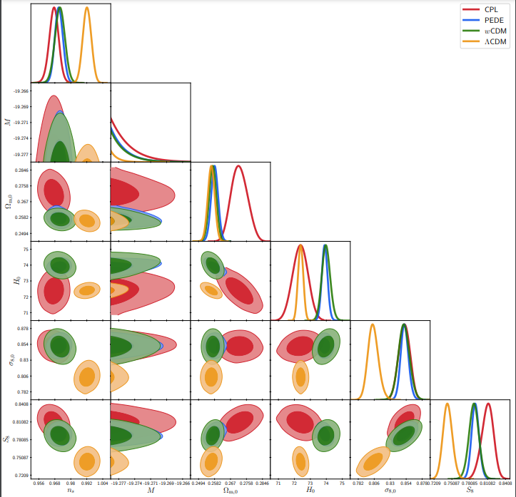

# Late transition vs smooth H(z) deformation models for the resolution of the Hubble crisis

This is the repository that contains part of the codes as well as useful comments that reproduce the figures of our project. The zip folder CLASS Implementations only contains the files that are modified in order to implement the Transition Models in the CLASS and MontePython programs. In particular, the default `background.c`, `input.c` and `background.h` should be substituted with the corresponding files of the zip folder. Furthermore, the `Pantheon_SN` folder should be added to the default `.../montepython/likelihoods` folder in order to correctly implement the transition on the absolute magnitude *M* at zt. The files `Fig_1.nb` and `Absolute_Magnitude_BestFit.nb` correspond to the Mathematica codes for the construction of Fig. 1 and Fig. 7 respectively. Finally, in order to estimate the statistical significance of our results we used the Akaike Information Criterion (AIC) as well as the [MCEvidence](https://github.com/yabebalFantaye/MCEvidence) package. For the AIC, we derived the corresponding differences using the Mathematica file `AIC_Calculations.nb`.

## Abstract
Gravitational transitions at low redshifts ($z_t<0.1$) have been recently proposed  as a solution to the Hubble and growth tensions. Such transitions would naturally lead to a transition in the absolute magnitude $M$ of type Ia supernovae (SnIa) at $z_t$ (Late $M$ Transitions -  $LMT$) and possibly in the dark energy equation of state parameter $w$ (Late $w-M$ Transitions -  $LwMT$). Here, we compare the quality of fit of this class of models to cosmological data, with the corresponding quality of fit of the cosmological constant model ($\Lambda$CDM) and some of the best smooth $H(z)$ deformation models ($w$CDM, CPL, PEDE). We also perform model selection via the Akaike Information Criterion and the Bayes factor. We use the full CMB temperature anisotropy spectrum data, the baryon acoustic oscillations (BAO) data, the Pantheon SnIa data, the SnIa absolute magnitude $M$ as determined by Cepheid calibrators and the value of the Hubble constant $H_0$ as determined by local SnIa calibrated using Cepheids. We find that smooth $H(z)$ deformation models perform worse than transition models for the following reasons:
1) They have a worse fit to low-$z$ geometric probes (BAO and SnIa data);
2) They favor values of the SnIa absolute magnitude $M$ that are lower as compared to the value $M_c$ obtained with local Cepheid calibrators at $z<0.01$;
3) They tend to worsen the  $\Omega_\mathrm{m,0}-\sigma_\mathrm{8,0}$ growth tension.
We also find that the $w-M$ transition model ($LwMT$) does not provide a better quality of fit to cosmological data than a pure $M$ transition model ($LMT$) where $w$ is fixed to the $\Lambda$CDM value $w=-1$ at all redshifts. We conclude that the $LMT$ model has significant statistical advantages over smooth late-time $H(z)$ deformation models in addressing the Hubble crisis. 

## Instructions - CLASS Implementation
* Install the [CLASS](https://github.com/brinckmann/class_public) and [MontePython programs](https://github.com/brinckmann/montepython_public) as it is described in their official repositories.

* Substitute the appropriate files with the corresponding ones inside the folder `CLASS Implementations` and run the programs as usual. For a step-by-step guide of the modifications implemented in CLASS, [click here](https://cosmology.physics.uoi.gr/wp-content/uploads/2021/07/Class_Implementation-1.pdf).

* In our analysis we include a robust Redshift Space Distortion compilation presented [here](https://arxiv.org/pdf/1806.10822.pdf). For the implementation of the likelihood follow the instructions of [this](https://github.com/snesseris/RSD-growth) github repository.

## Citing the paper 
If you use any of the above codes or the figures in a published work please cite the following paper:
 *Late transition vs smooth H(z) deformation models for the resolution of the Hubble crisis*
 George Alestas, David Camarena, Eleonora Di Valentino, Lavrentios Kazantzidis, Valerio Marra, Savvas Nesseris, and Leandros Perivolaropoulos

Any further questions/comments are welcome.

## Authors List
George Alestas - <g.alestas@uoi.gr>
 David Camarena - <david.f.torres@aluno.ufes.br>
 Eleonora Di Valentino - <eleonora.di-valentino@durham.ac.uk>
 Lavrentios Kazantzidis - <l.kazantzidis@uoi.gr>
 Valerio Marra - <valerio.marra@me.com>
 Savvas Nesseris - <savvas.nesseris@csic.es>
 Leandros Perivolaropoulos - <leandros@uoi.gr>
